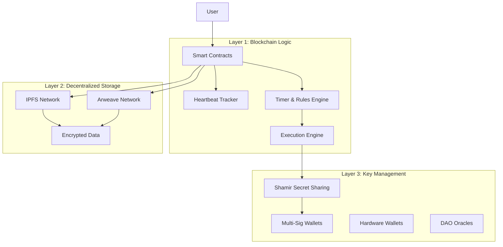
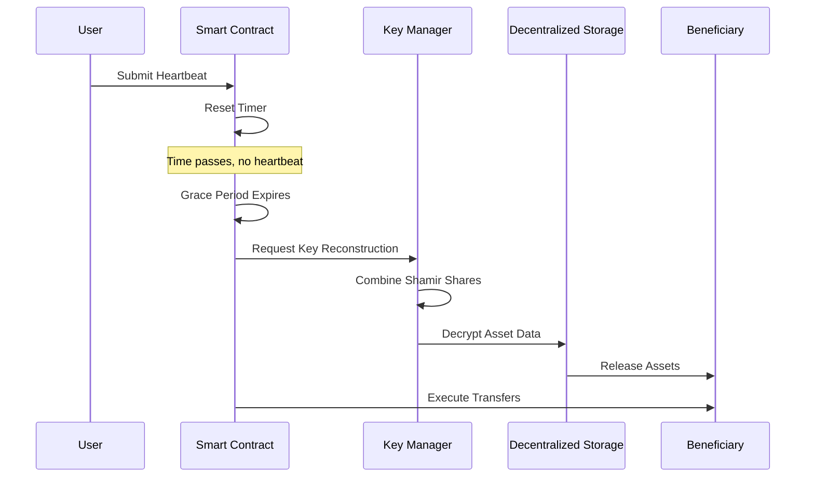

# Design Document: Decentralized Digital Will Protocol

## Overview

The Decentralized Digital Will Protocol is a blockchain-based system that automatically transfers digital assets and access credentials to designated beneficiaries when a user becomes inactive. The system combines time-based smart contracts, cryptographic key management, and decentralized storage to create a trustless inheritance mechanism.

The architecture follows a three-layer approach: blockchain logic for automation and rules, decentralized storage for encrypted data, and distributed key management for security. The system operates entirely without centralized authorities, courts, or trusted intermediaries.

## Architecture

### Three-Layer Architecture



### Component Interaction Flow



## Components and Interfaces

### Smart Contract Layer

**HeartbeatTracker Contract**
- Tracks user heartbeat timestamps
- Validates heartbeat authenticity through signature verification
- Manages configurable heartbeat intervals (7-365 days)
- Triggers grace period when heartbeat expires

**InheritanceRules Contract**
- Stores beneficiary assignments and release rules
- Manages asset-to-beneficiary mappings
- Enforces release timing delays
- Handles partial and conditional releases

**ExecutionEngine Contract**
- Orchestrates the asset release process
- Coordinates with key management for decryption
- Executes multi-signature wallet transactions
- Maintains audit logs of all actions

### Key Management Layer

**Shamir Secret Sharing Implementation**
Based on research from [Web3Auth](https://web3auth.io/docs/infrastructure/sss-architecture) and [Privy](https://www.privy.io/blog/shamir-secret-sharing-deep-dive), the system implements threshold cryptography where:
- Master encryption key split into 5 shares
- 3 shares required for reconstruction (3-of-5 threshold)
- Shares distributed across: smart contract, trusted persons, DAO oracles, user devices, hardware wallets
- Information-theoretic security ensures no information leakage below threshold

**Multi-Signature Wallet Integration**
Using [Gnosis Safe](https://safe.global/) architecture for cryptocurrency asset management:
- 2-of-3 or 3-of-5 signature requirements
- Hardware wallet integration for enhanced security
- Support for multiple blockchain networks
- Programmable transaction execution

### Storage Layer

**Hybrid IPFS/Arweave Architecture**
Based on the [Arweave+IPFS bridge](https://arweave.medium.com/arweave-ipfs-persistence-for-the-interplanetary-file-system-9f12981c36c3):
- IPFS for fast access and content addressing
- Arweave for permanent storage and data persistence
- Content hashes stored on blockchain for verification
- AES-256 encryption applied before storage

## Data Models

### User Configuration Model
```typescript
interface UserConfig {
  userId: string;
  heartbeatInterval: number; // days (7-365)
  gracePeriod: number; // days (30-180)
  lastHeartbeat: timestamp;
  emergencyContacts: ContactInfo[];
  status: 'active' | 'grace_period' | 'triggered' | 'emergency_override';
}
```

### Asset Model
```typescript
interface DigitalAsset {
  assetId: string;
  type: 'crypto_wallet' | 'credentials' | 'document' | 'message';
  encryptedData: string; // AES-256 encrypted
  storageHash: string; // IPFS/Arweave hash
  keyShares: ShamirShare[];
  beneficiaryRules: BeneficiaryRule[];
}
```

### Beneficiary Rule Model
```typescript
interface BeneficiaryRule {
  beneficiaryId: string;
  assetId: string;
  releaseDelay: number; // days after trigger
  conditions: ReleaseCondition[];
  walletAddress: string;
  contactInfo: ContactInfo;
}
```

### Shamir Share Model
```typescript
interface ShamirShare {
  shareId: number;
  shareData: string; // encrypted share
  holder: 'smart_contract' | 'trusted_person' | 'dao_oracle' | 'user_device' | 'hardware_wallet';
  holderAddress: string;
}
```

Now I need to use the prework tool to analyze the acceptance criteria before writing the correctness properties:
## Correctness Properties

*A property is a characteristic or behavior that should hold true across all valid executions of a system—essentially, a formal statement about what the system should do. Properties serve as the bridge between human-readable specifications and machine-verifiable correctness guarantees.*

### Property 1: Heartbeat Lifecycle Management
*For any* user with a configured heartbeat interval, when a valid heartbeat is submitted, the inactivity timer should reset to zero and the grace period should be cancelled if active.
**Validates: Requirements 1.2, 1.4, 4.4**

### Property 2: Input Validation Consistency  
*For any* input value (heartbeat intervals, wallet addresses, JSON configurations), the system should consistently accept valid inputs and reject invalid inputs with descriptive error messages.
**Validates: Requirements 8.1, 8.2, 8.3, 8.4**

### Property 3: Encryption Security Invariant
*For any* digital asset stored in the system, the asset should be encrypted with AES-256 before storage, and private keys should never exist in plain text anywhere in the system.
**Validates: Requirements 2.1, 2.3**

### Property 4: Shamir Secret Sharing Security
*For any* encryption key in the system, it should be split into exactly 5 shares with a 3-share reconstruction threshold, and no single entity should ever possess 3 or more shares.
**Validates: Requirements 2.5, 6.1, 6.4**

### Property 5: Configuration Round-Trip Consistency
*For any* valid configuration object, parsing then pretty-printing then parsing should produce an equivalent object.
**Validates: Requirements 8.6**

### Property 6: Grace Period Trigger Logic
*For any* user whose heartbeat interval expires without a signal, the system should initiate the grace period and trigger asset release only after the grace period also expires without a heartbeat.
**Validates: Requirements 1.5, 4.1, 4.5**

### Property 7: Beneficiary Rule Enforcement
*For any* asset with defined beneficiary rules, when release conditions are met, the asset should be released only to the specified beneficiaries according to the defined timing and distribution rules.
**Validates: Requirements 3.1, 3.4, 5.3**

### Property 8: Multi-Signature Transaction Security
*For any* cryptocurrency asset transfer, the transaction should require the specified number of signatures (2-of-3 or 3-of-5) and should not execute with insufficient signatures.
**Validates: Requirements 5.4, 6.3**

### Property 9: Emergency Override Recovery
*For any* triggered asset release, if an emergency override is activated within the 7-day veto window with proper enhanced authentication, the release process should be completely rolled back for unreleased assets.
**Validates: Requirements 7.1, 7.2, 7.3, 7.4**

### Property 10: Notification Delivery Completeness
*For any* system event requiring notifications (heartbeat reminders, grace period start, beneficiary alerts), notifications should be delivered to all specified channels and recipients.
**Validates: Requirements 4.2, 4.3, 9.1, 9.2**

### Property 11: Audit Trail Immutability
*For any* system action (heartbeat, asset release, emergency override), an immutable audit log entry should be created with complete action details suitable for legal review.
**Validates: Requirements 5.5, 7.5, 10.4**

### Property 12: Storage Architecture Consistency
*For any* encrypted asset, the actual data should be stored on decentralized storage (IPFS/Arweave) while only the content hash should be stored on the blockchain.
**Validates: Requirements 2.2**

### Property 13: Legal Document Integrity
*For any* legal document attached to the system, a cryptographic hash should be stored on the blockchain that can verify the document's integrity.
**Validates: Requirements 10.1, 10.3**

## Error Handling

### Heartbeat Failures
- **Network Issues**: Retry mechanism with exponential backoff
- **Invalid Signatures**: Clear error messages with authentication guidance
- **Expired Sessions**: Automatic re-authentication prompts

### Key Reconstruction Failures
- **Insufficient Shares**: Graceful degradation with partial asset release
- **Corrupted Shares**: Share verification and recovery from backup holders
- **Network Partitions**: Timeout handling with manual intervention options

### Storage Failures
- **IPFS Unavailability**: Automatic fallback to Arweave
- **Encryption Errors**: Secure error logging without exposing sensitive data
- **Hash Mismatches**: Data integrity verification and re-upload procedures

### Smart Contract Failures
- **Gas Limit Issues**: Dynamic gas estimation with user confirmation
- **Transaction Reverts**: Detailed error analysis and retry mechanisms
- **Oracle Failures**: Fallback to manual verification processes

## Testing Strategy

### Dual Testing Approach

The system requires both unit testing and property-based testing for comprehensive coverage:

**Unit Tests** focus on:
- Specific examples demonstrating correct behavior
- Edge cases and boundary conditions
- Error handling scenarios
- Integration points between components

**Property-Based Tests** focus on:
- Universal properties that hold across all inputs
- Comprehensive input coverage through randomization
- Correctness properties defined in this document

### Property-Based Testing Configuration

**Framework**: [fast-check](https://fast-check.dev/) for TypeScript/JavaScript implementation
**Test Configuration**:
- Minimum 100 iterations per property test
- Each test tagged with: **Feature: digital-will-protocol, Property {number}: {property_text}**
- Custom generators for blockchain addresses, timestamps, and cryptographic keys
- Shrinking enabled for minimal counterexample discovery

**Key Testing Patterns**:
1. **Round-trip properties** for serialization/deserialization
2. **Invariant properties** for security constraints (no plain text keys, proper share distribution)
3. **State transition properties** for heartbeat and grace period logic
4. **Metamorphic properties** for encryption and key management operations

### Unit Testing Balance

Unit tests complement property tests by providing:
- Concrete examples of expected behavior
- Regression testing for known issues
- Integration testing between system components
- Performance and gas optimization validation

Property tests provide broader coverage by:
- Testing universal correctness properties
- Discovering edge cases through randomization
- Validating system behavior across large input spaces
- Ensuring cryptographic operations maintain security properties

Both testing approaches are essential for a production-ready digital inheritance system where correctness and security are paramount.