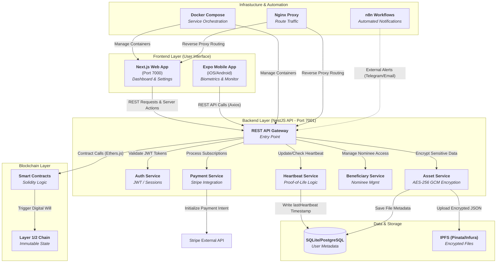

# Always There Protocol: Project Architecture

This document contains the complete architectural breakdown of the Always There Protocol.

## System Architecture Diagram

## Component Details

| Component | Technology | Role |
| :--- | :--- | :--- |
| **Frontend (Web)** | Next.js, Tailwind CSS | Primary dashboard for users to manage their "will". |
| **Frontend (Mobile)** | Expo, React Native | Secure on-the-go monitoring and biometric check-ins. |
| **Backend API** | NestJS, TypeScript | Central logic hub for security and orchestration. |
| **Heartbeat** | Node-cron / Logic | Monitors user activity to ensure they are "alive". |
| **Vault (Asset)** | IPFS + AES-256 | Stores encrypted data in a decentralized manner. |
| **Blockchain** | Solidity, Hardhat | Handles immutable execution of the digital will. |
| **Infrastructure** | Docker, Nginx, n8n | Ensures scalability, security, and automation. |

---
*Created for: Always There Protocol Dev Team*
